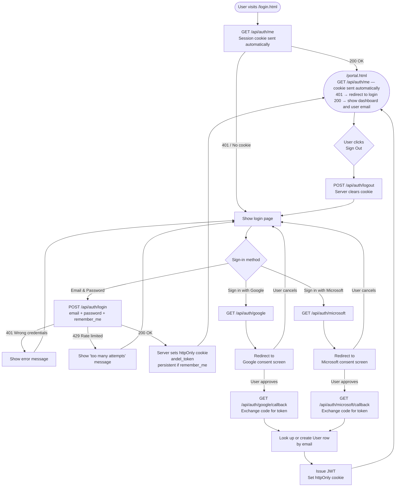

# Resident Authentication — Session Flow

```mermaid
flowchart TD
    A([User visits /login.html]) --> B[GET /api/auth/me\nSession cookie sent automatically]

    B -- 200 OK --> PORTAL
    B -- 401 / No cookie --> D[Show login page]

    D --> F{Sign-in method}

    F -- Email & Password --> G[POST /api/auth/login\nemail + password + remember_me]
    G -- 401 Wrong credentials --> H[Show error message]
    H --> D
    G -- 429 Rate limited --> RL[Show 'too many attempts' message]
    RL --> D
    G -- 200 OK --> I[Server sets httpOnly cookie\nandel_token\npersistent if remember_me]
    I --> PORTAL

    F -- Sign in with Google --> J[GET /api/auth/google]
    F -- Sign in with Microsoft --> K[GET /api/auth/microsoft]

    J --> L[Redirect to\nGoogle consent screen]
    K --> M[Redirect to\nMicrosoft consent screen]

    L -- User approves --> N[GET /api/auth/google/callback\nExchange code for token]
    M -- User approves --> O[GET /api/auth/microsoft/callback\nExchange code for token]
    L -- User cancels --> D
    M -- User cancels --> D

    N --> P[Look up or create User row\nby email]
    O --> P
    P --> Q[Issue JWT\nSet httpOnly cookie]
    Q --> PORTAL

    PORTAL([/portal.html\nGET /api/auth/me — cookie sent automatically\n401 → redirect to login\n200 → show dashboard and user email])

    PORTAL --> W{User clicks\nSign Out}
    W --> X[POST /api/auth/logout\nServer clears cookie]
    X --> D
```
